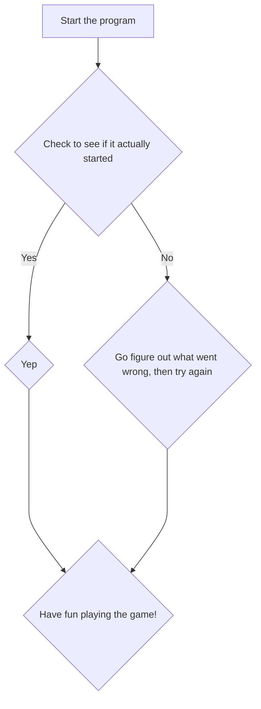

```mermaid
flowchart TD
  A[Start the program] --> B{Check to see if it actually started}
  B -- Yes --> C{Yep};
  B -- No --> D{Go figure out what went wrong, then try again};
  C ----> E{Have fun playing the game!};
  D ----> E{Have fun playing the game!};
```
